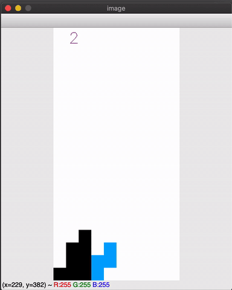

# Deep Learning Tetris Project

## Demo of a convolutional neural network playing tetris

## Options
- Fully connected neural network with board as input and two different reward mechanisms (the matrix rewar function and the predicted goodness of board state).
- Two different convolutional neural networks. One CNN which uses 1 input, another convolutional neural network which uses two times the same input an concatenates branches later on.
- Ability to load models and play tetris using those models.
## Modes
- Training mode lets the model train (possibly from scratch or from an existing model.
- Play mode lets the saved model play the game.
- Play mode Nuno faria shows how the original model plays https://github.com/nuno-faria/tetris-ai.

## Implemented strategies
### In play mode
put model name that you want it to play in run.py model_name\
set model_number = 1/2/3/4 in run.py depending on the type of model you want to play.\
set render_every = 1  in run.py\
set agent_play = True in run.py\
set fetch_old_model = True in run.py\
the model will not be trained nor will be saved\
the amount of lines cleared will be saved per run
### play mode Nuno Faria  
set model model_name = 'models/original'
### training from scratch mode Nuno Faria  
set model_number =  4 in run.py\
set agent_play = False in run.py\
set rendering = True in run.py\
set render_every = 500 (up to you)  in run.py\
set fetch_old_model = False in run.py\
set the training parameters in run.py (parameters in def dqn():)\
set the return function to return score, self.game_over in tetris.py
### training full board from scratch (best state reward function)
set model_number =  1/2/3 in run.py\
set agent_play = False in run.py\
set rendering = True in run.py\
set fetch_old_model = False in run.py\
set agent_play = False\
set board_state = False
### train with matrix reward function
if you want to train using matrix reward function\
set the return function to return sum_model_reward, self.game_over in tetris.py
### continue training 
continues the model from training with its current weights\
keep in mind that it will start exploring in the beginning again depending # on epsilon_stop_episode\
put model name that you want it to train in run.py model_name\
set model_number = 1/2/3/4 in run.py depending on the type of model you want to train.\
set rendering = True in run.py\
set render_every = 500 (up to you)  in run.py\
set agent_play = False in run.py\
set fetch_old_model = True in run.py
## Output files
There are 3 output files\
- The tensorboard file (events.out&ast;). Model score and training time is saved.
From the terminal type 'tensorboard --logdir="path/to/folder/"'.
- The files that log amount of lines cleared (linesfile-&ast;.txt). By setting the filename in plotter.py and running it, a plot of the amount of lines cleared will be showed.
- The models In the directory models, after the training is finished the model will be saved. These load to play or train further.
- All models, log files, and lines cleared are saved with same date-time stamp and the relevent model_number. 
### KNOWN ISSUES:
The environment: the model sometimes has a gameover in a wrong state, this usually happens when it goes game over when there is an entire empty row as top row, but the row below that has atleast 1 block in it. The game then places a block in a possible place, but goes gameover before it places this block.

### Peregrine RUG HPC:
there is a ready script run.sh which creats the virtual environment and start the training the mode for 2M epochs\
Requirements:\
Tensorflow (tensorflow-gpu==1.14.0, CPU version can be used too)\
Tensorboard (tensorboard==1.14.0)\
Keras (Keras==2.2.4)\
Opencv-python (opencv-python==4.1.0.25)\
Numpy (numpy==1.16.4)\
Pillow (Pillow==5.4.1)\
Tqdm (tqdm==4.31.1)
